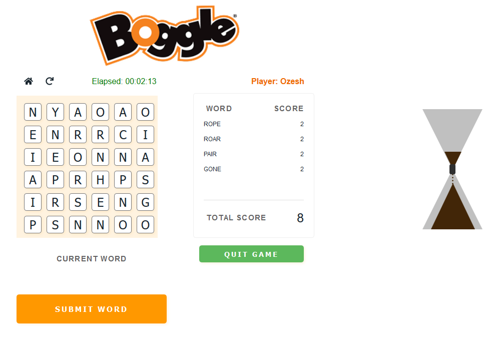

[](https://github.com/zaagan/boggle-rails-react) [](https://github.com/zaagan/boggle-rails-react) [](https://github.com/zaagan/boggle-rails-react) [](https://github.com/zaagan/boggle-rails-react) [](https://github.com/zaagan/boggle-rails-react) [](https://github.com/zaagan/boggle-rails-react) [](https://github.com/zaagan/boggle-rails-react) [](https://github.com/zaagan/boggle-rails-react) [](https://github.com/zaagan/boggle-rails-react) 


# A Boggle Game

This is a [Ruby on Rails](https://rubyonrails.org/) and [React.js](https://reactjs.org/) based implementation of the **Boggle** game.


[Check out the demo on Heroku](https://ruby-react-boggle.herokuapp.com/)


## Built with

- Ruby 2.6.5p114

- Rails 6.0.1

- Node : v12.13.1 

- npm : 6.6.0 or Yarn

- React JS 16.12.0

  

## Quick Start

You need to have bundler installed in your system.

**Step 1:** You can install it by typing:

```bash
$ gem install bundler
```


**Step 2:** Install all the related package.

Open of a terminal window in the root of the project **/boggle-rails-react** and type :

```bash
$ bundle install
```


**Step 3:** Install the necessary node packages:

```bash
$ yarn install or 
$ npm install
```


**Step 4:** Run the server:

```bash
$ rails server
```


**Note:**  *All database dependencies, Active records dependencies have been intentionally removed as we wont be needing them for this demo project.*


## How it works ?

[**Boggle**](https://en.wikipedia.org/wiki/Boggle) is a [word game](https://en.wikipedia.org/wiki/Word_game) invented by Allan Turoff and originally distributed by [Parker Brothers](https://en.wikipedia.org/wiki/Parker_Brothers). The game is played using a grid of letters, in which the players attempt to find words in sequences of adjacent letters. 


Basically, The player searches for words that can be constructed from the letters of sequentially adjacent cubes, where "adjacent" cubes are those  horizontally, vertically and diagonally neighboring. Words must be at  least three letters long, may include singular and plural (or other derived forms) separately. The application records all the words that is submitted by the players. After **three minutes** have elapsed, the application stops the player from the game play and the game enters the scoring phase. 


## Running the tests


#### Testing the Rails APIs

You can test the Rails API by executing the following code in a terminal window, at the root of the (**/boggle-rails-react**) project:

```bash
$ bundle exec rspec
```


#### Testing JavaScript

```bash
$ yarn test
```


## Screenshots

##### Home Page  Preview


##### Stage 1 Preview




## License

MIT © [Zaagan](https://github.com/zaagan) 


## Author

- **Ozesh Thapa** - [@Zaagan](https://github.com/zaagan)  | [DebuggersHub](https://www.debuggershub.com/)


## Credits and References

- [Wikipedia Definition](https://en.wikipedia.org/wiki/Boggle)
- [JS-Boggle-Game](https://github.com/zhouyuhang/JS-Boggle-Game)
- [CodePen - Sample](https://codepen.io/jbalesteri/pen/yYeozq) |
- [For the User Interface - CodePen - Sample 2](https://codesandbox.io/s/github/leannezhang/boggle-game/tree/master/?from-embed)
- [Joe Taylor's CSS3 Hourglass](https://codepen.io/joekarma/pen/gjxyF)

